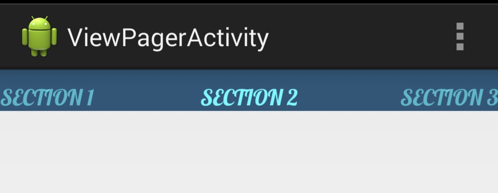

FontPagerTitleStrip
===================

Library that allows you to customize the font of a `PagerTitleStrip`.



## Usage
 
```XML
<me.alexrs.fontpagertitlestrip.lib.FontPagerTitleStrip
	android:id="@+id/titlestrip"
	android:layout_width="match_parent"
	android:layout_height="30dp
```
You can use the following attributes:

Font family:
```XML
app:fontFamily="sans-serif|sans-serif-light|sans-serif-condensed|sans-serif-thin"
```
Text style:
```XML
app:textStyle="normal|bold|italic"
```

Also, this library provides the following methods to customize the font and the appearence of your `PagerTitleStrip`

```JAVA
FontPagerTitleStrip mPagerTitleStrip = (FontPagerTitleStrip) findViewById(R.id.titlestrip);
// You can use sans-serif|sans-serif-light|sans-serif condensed|sans-serif-thin
mPagerTitleStrip.setTypefaceByFontFamily("sans-serif-condensed");
mPagerTitleStrip.setTypefaceByFontFamily.setTypefaceByFontFamily("sans-serif-light", Typeface.BOLD);
mTitleStrip.setTypefaceFromAssets("fonts/myfont.ttf");
Typeface mTypeface = Typeface.createFromAsset(getAssets(), "fonts/myfont");
mTitleStrip.setTypeface(mTypeface, "myfont");
```

If you have any doubt or suggestion, please, let me know!